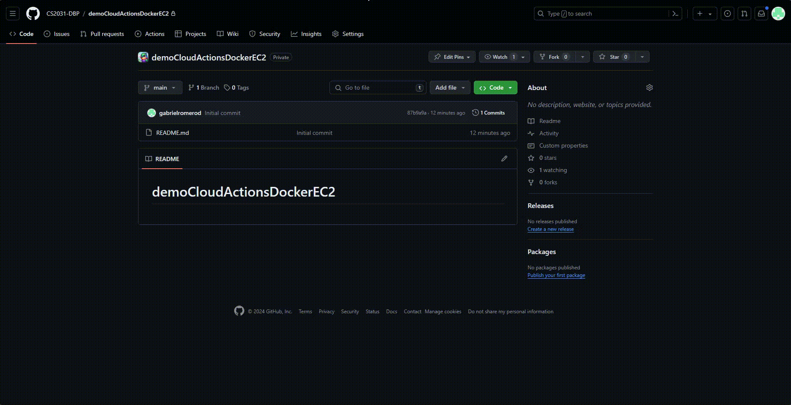
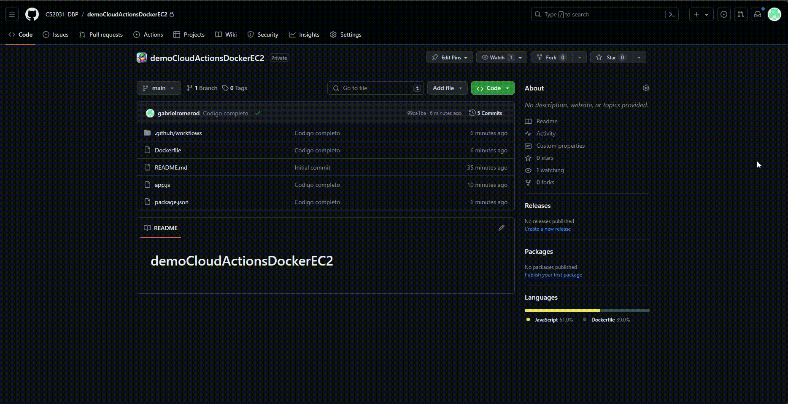

# Github Actions y Docker en EC2: Automatización y despliegue 🚀

En clases anteriores hemos desvelado el potencial de Github Actions como herramienta clave para automatizar los procesos de integración y despliegue continuo (CI/CD) de aplicaciones. ¡Es hora de ir un paso más allá! 🌟 En este capítulo, vamos a aprender de forma práctica y sencilla cómo usar Github Actions para crear una imagen de Docker 🐳, subirla a un repositorio, y posteriormente, descargarla y ejecutarla automáticamente en una instancia de EC2 🖥️. Te guiaré paso a paso para que te conviertas en un experto en la automatización y el despliegue eficaz usando Github Actions y Docker en EC2.

## Introducción a Github Actions

Github Actions es una potente herramienta de CI/CD que nos permite automatizar y personalizar flujos de trabajo directamente desde nuestros repositorios de GitHub. Mediante la definición de flujos de trabajo en archivos YAML, Github Actions puede reaccionar a eventos específicos, como solicitudes de extracción o actualizaciones en ramas principales, ejecutando tareas automáticamente.

### Ejemplo de un flujo de trabajo con Github Actions:

Considera el siguiente ejemplo de archivo YAML para entender cómo se configura un flujo de trabajo básico:

```yaml
name: CI

on:
  push:
    branches:
      - main

jobs:
    build:
        runs-on: ubuntu-latest
    
        steps:
        - uses: actions/checkout@v2
        - name: Install dependencies
          run: npm install
        - name: Build
          run: npm run build
        - name: Test
          run: npm test
```

En este ejemplo, definimos un flujo llamado `CI` que se activa con cada `push` a la rama `main`. Este flujo se ejecuta en una máquina virtual Ubuntu, incluyendo pasos como instalar dependencias, construir la aplicación y realizar pruebas.

Con Github Actions, las posibilidades son amplias y flexibles. Podemos automatizar desde pruebas de código hasta el despliegue de aplicaciones, todo dentro de entornos virtuales configurables. Así, Github Actions se convierte no solo en un facilitador de tareas sino también en un impulsor de la eficiencia en nuestros proyectos.

Prepárate para explorar más y transformar tu forma de trabajar con estas herramientas en el siguiente segmento del curso. ¡Vamos a ello! 🌐🛠

## Trabajando con Docker en Github Actions

Vamos a crear un proyecto de ejemplo para comprender cómo podemos integrar Docker en Github Actions. Una aplicación sencilla en Node.js será nuestro punto de partida. A continuación, te muestro los pasos a seguir:

1. **Crear un repositorio en GitHub**: Inicia un nuevo repositorio en GitHub y clónalo en tu máquina local.

2. **Crear una aplicación en Node.js**: Crea una aplicación sencilla en Node.js. El nombre del archivo principal puede ser `app.js` y el contenido puede ser el siguiente:

```javascript
// Importar el módulo HTTP de Node.js
const http = require('http');

// Crear un servidor HTTP
const server = http.createServer((req, res) => {
    // Establecer el código de estado HTTP y el tipo de contenido de la respuesta
    res.writeHead(200, { 'Content-Type': 'text/plain' });

    // Enviar un mensaje de respuesta
    res.end('Hello World!');
});

// Hacer que el servidor escuche en el puerto 3000
server.listen(3000, () => {
    console.log('Server running on port 3000');
});
```

También, crea un archivo `package.json` con la siguiente configuración:

```json
{
    "name": "my-node-app",
    "version": "1.0.0",
    "description": "A simple Node.js application",
    "main": "app.js",
    "scripts": {
        "start": "node app.js"
    },
    "dependencies": {}
}
```

3. **Crear un archivo Dockerfile**: Crea un archivo llamado `Dockerfile` en la raíz del proyecto con el siguiente contenido:

```dockerfile
# Usar una imagen base de Node.js
FROM node:18

# Establecer el directorio de trabajo
WORKDIR /app

# Copiar el archivo package.json e instalar las dependencias
COPY package*.json ./

RUN npm install

# Copiar el código fuente de la aplicación
COPY . .

# Exponer el puerto 3000
EXPOSE 3000

# Comando para ejecutar la aplicación
CMD ["node", "app.js"]
```

4. **Crear un archivo de configuración de Github Actions**: Crea un directorio llamado `.github/workflows` en la raíz del proyecto y dentro de él, un archivo YAML llamado `docker.yml` con el siguiente contenido:

```yaml
name: Docker

on:
  push:
    branches:
      - main

jobs:
  build:
    runs-on: ubuntu-latest

    steps:
    - uses: actions/checkout@v2
    - name: Build the Docker image
      run: docker build -t my-node-app .
    - name: Push the Docker image to Docker Hub
      run: echo ${{ secrets.DOCKER_PASSWORD }} | docker login -u ${{ secrets.DOCKER_USERNAME }} --password-stdin
    - run: docker tag my-node-app ${{ secrets.DOCKER_USERNAME }}/my-node-app
    - run: docker push ${{ secrets.DOCKER_USERNAME }}/my-node-app
```

En este archivo YAML, definimos un flujo de trabajo llamado `Docker` que se activa con cada `push` a la rama `main`. Dentro de este flujo, se ejecutan los pasos necesarios para construir la imagen de Docker de nuestra aplicación, etiquetarla y subirla a Docker Hub.

5. **Configurar las variables de entorno en el repositorio**: En la configuración del repositorio en GitHub, ve a `Settings` > `Secrets` encontrarás dos opciones para agregar `Environment Secrets` y `Repository Secrets`. Seleccione `Repository Secrets` y agrega las variables `DOCKER_USERNAME` y `DOCKER_PASSWORD` con tus credenciales de Docker Hub. Son tus credenciales de Docker Hub para que Github Actions pueda subir la imagen de Docker a tu cuenta. En caso de tener dudas, revise el capítulo anterior sobre cómo configurar las credenciales de [Docker Hub](03-docker-ec2.md).



6. **Probar el flujo de trabajo**: Realiza un `push` a la rama `main` de tu repositorio en GitHub. Ve a la sección `Actions` y podrás ver el flujo de trabajo `Docker` en ejecución. Una vez finalizado, verifica que la imagen de Docker se haya subido correctamente a Docker Hub.



¡Listo! Has creado un flujo de trabajo con Github Actions que construye una imagen de Docker de tu aplicación y la sube a Docker Hub. Ahora, es momento de llevar este proceso un paso más allá y desplegar la imagen de Docker en una instancia de EC2. ¡Vamos a ello! 🚀

## Desplegando una imagen de Docker en EC2 con Github Actions

Ya hemos logrado construir y subir una imagen de Docker a Docker Hub con Github Actions. Ahora, vamos a desplegar esta imagen en una instancia de EC2. Para ello, necesitamos realizar los siguientes pasos:

1. **Crear una instancia de EC2**: Inicia sesión en la consola de AWS y crea una instancia de EC2 con la configuración que prefieras. Asegúrate de abrir el puerto 3000 en el grupo de seguridad de la instancia para permitir el tráfico de la aplicación.


2. **Modificar el archivo de configuración de Github Actions**: En el archivo YAML `docker.yml`, agrega los siguientes pasos para conectarte a la instancia de EC2 y ejecutar la imagen de Docker:

```yaml
- name: Deploy to EC2
    uses: appleboy/ssh-action@v0.1.7
    with:
        host: ${{ secrets.EC2_HOST }}
        username: ubuntu
        key: ${{ secrets.EC2_SSH_KEY }}
        script: |
          # Descargar la última imagen de Docker desde Docker Hub
          docker pull ${{ secrets.DOCKER_USERNAME }}/my-node-app
          # Detener y eliminar cualquier contenedor antiguo
          docker stop my-node-app || true
          docker rm my-node-app || true
          # Ejecutar un nuevo contenedor con la última imagen
          docker run -d -p 3000:3000 --name my-node-app ${{ secrets.DOCKER_USERNAME }}/my-node-app
```

### Descripción de los pasos adicionales

1. **Deploy to EC2**: Esta sección utiliza la acción `appleboy/ssh-action` para conectarse a la instancia de EC2 mediante SSH.
2. **Script de despliegue**: El script ejecuta una serie de comandos en la instancia de EC2:
    - **Navega al directorio del proyecto**: Ajusta el path según la configuración de tu proyecto en la instancia.
    - **Descargar la última imagen de Docker**: Usa `docker pull` para obtener la imagen más reciente desde Docker Hub.
    - **Detener y eliminar cualquier contenedor antiguo**: Usa `docker stop` y `docker rm` para detener y eliminar cualquier contenedor en ejecución con el mismo nombre.
    - **Ejecutar un nuevo contenedor**: Usa `docker run` para crear y ejecutar un nuevo contenedor con la última imagen.

### Configuración de secretos en GitHub

Asegúrate de configurar los siguientes secretos en la configuración de tu repositorio de GitHub (`Settings > Secrets and variables > Actions > Repository secrets`):

- `DOCKER_USERNAME`: Tu nombre de usuario de Docker Hub.
- `DOCKER_PASSWORD`: Tu contraseña de Docker Hub.
- `EC2_HOST`: La dirección IP pública de tu instancia de EC2.
- `EC2_SSH_KEY`: Tu clave privada SSH para conectarte a la instancia de EC2.

Con estas configuraciones, tu pipeline de GitHub Actions estará listo para construir, subir y desplegar automáticamente tu aplicación Node.js en una instancia de EC2 utilizando Docker.

3. **Probar el despliegue**: Realiza un `push` a la rama `main` de tu repositorio en GitHub. Ve a la sección `Actions` y podrás ver el flujo de trabajo `Docker` en ejecución. Una vez finalizado, verifica que la imagen de Docker se haya desplegado correctamente en la instancia de EC2.

Prueba accediendo a la dirección IP pública de tu instancia de EC2 en el puerto 3000 y verás tu aplicación en funcionamiento.


¡Felicidades! Has logrado desplegar una imagen de Docker en una instancia de EC2 utilizando Github Actions. Este proceso automatizado te permitirá ahorrar tiempo y esfuerzo en el despliegue de tus aplicaciones, brindándote mayor eficiencia y control en tus proyectos. ¡Sigue explorando y descubre todo el potencial de la automatización con estas herramientas! 🌟🚀